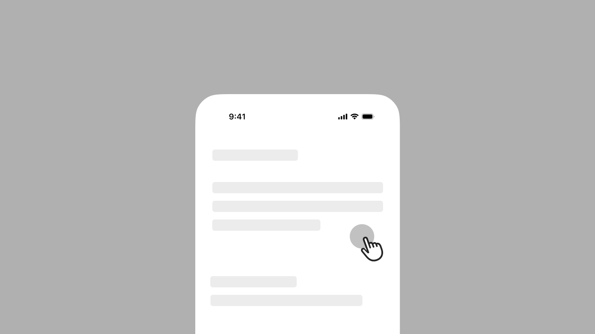

# touchpoints



Tiny React component for showing mobile touch points while recording demos from a device or a Simulator.

## Install

```txt
npm install touchpoints
```

## Usage

Render the component once near the app root. In Next.js, render it from a client component.

```tsx
"use client";

import { TouchPoints } from "touchpoints";

export function Providers({ children }: { children: React.ReactNode }) {
  return (
    <>
      {children}
      <TouchPoints />
    </>
  );
}
```

## Development

You will usually only want this in development, so render it conditionally in your app.

Vite:

```tsx
import.meta.env.DEV ? <TouchPoints /> : null;
```

Next.js:

```tsx
process.env.NODE_ENV !== "production" ? <TouchPoints /> : null;
```

## Configuration

You can customise the indicator with `size`, `color`, and `border`:

```tsx
<TouchPoints size={50} color="hotpink" border="3px solid blue" />
```

## Props

```ts
interface TouchPointsProps {
  size?: number;
  color?: string;
  border?: string;
}
```

## Acknowledgements

Heavy inspiration comes from [visualizeTouches](https://github.com/robb/visualizeTouches) by [@robb](https://github.com/robb) and [TouchInspector](https://github.com/jtrivedi/TouchInspector) by [@jtrivedi](https://github.com/jtrivedi)
